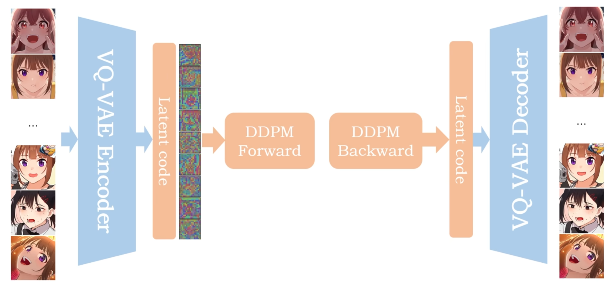
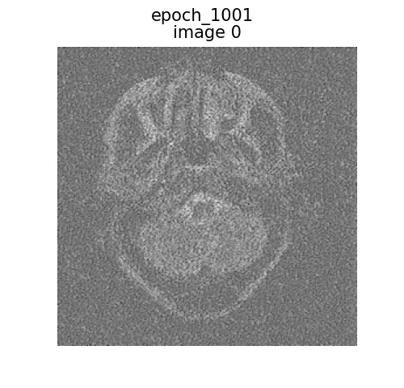
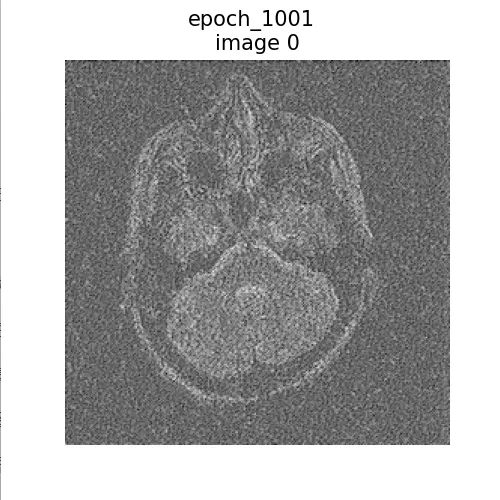
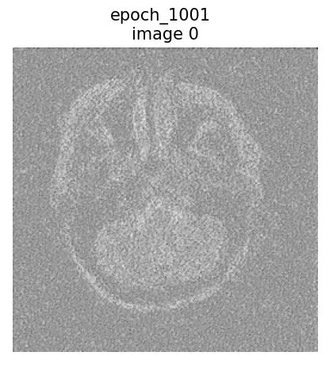

# project introduction
    this project is a continue learning project for me. I stored every tag for my experiment.

##  aim
    1. I want to realize the VAE model and generate some medical images.
    2. I want to realize the Diffusion model and contact with the VAE model.
    3. compare my model with the original model or orther model as a baseline.
## relevent model realized
### 1. latent diffusion model
    the detail structure of the model if shown in the images bellow:

#### forward process
##### 1. input our images to the autoencoder
##### 2. autoencoder outputs the latent space representation
##### 3. use the latent space representation to next step : DDPM Forward process

#### backward process
##### 4. DDPM Backward process
##### 5. use the latent space representation to next step : autoencoder
##### 6. autoencoder outputs the reconstructed images
## version details list
    In this part , I will record the every experiment version.
#### v1.0.0 2025/06/28 
    I realized the VAE model. But the result may really bad.you can see the result of 50 epochs.
|  |  |
| :------------------------------------: | :------------------------------------: |

#### v1.0.2 2025/06/30
    使用jupyter 运行一个人家写好的ddpm代码，用的是hugface的diffuers代码
    完成了基础模块，现在需要把人家的模型训练自己的训练集

#### v1.0.3 2025/07/08
    跑了1000个epoch ，得到的结果良好，但是生成的图像有噪点，怀疑是因为生成图像的timestep是随即的，这样会导致最后得到的图像可能不是最终的timestep
    
||||
| :------------------------------------: | :------------------------------------: | :------------------------------------: |