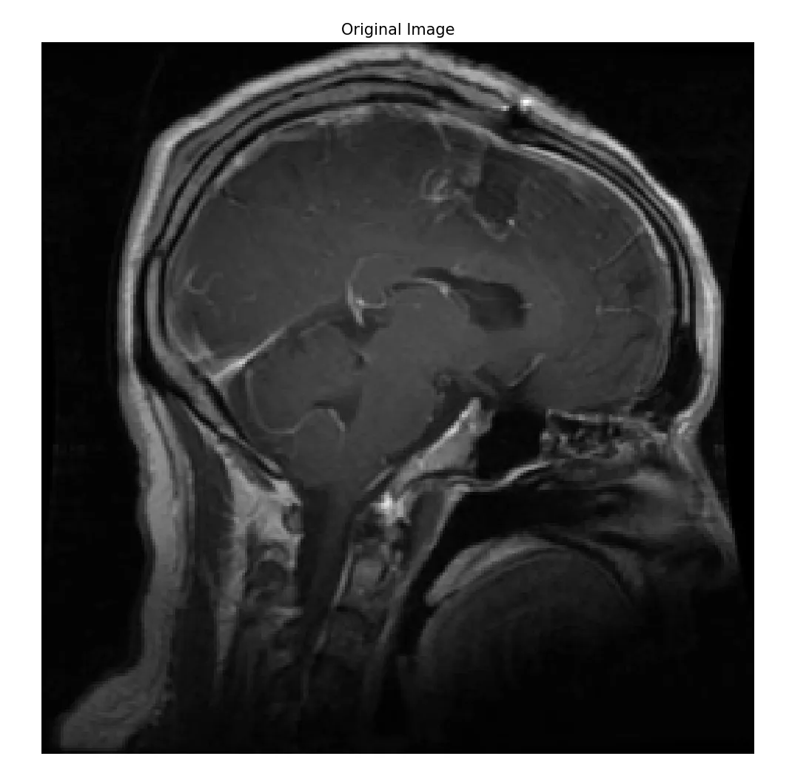
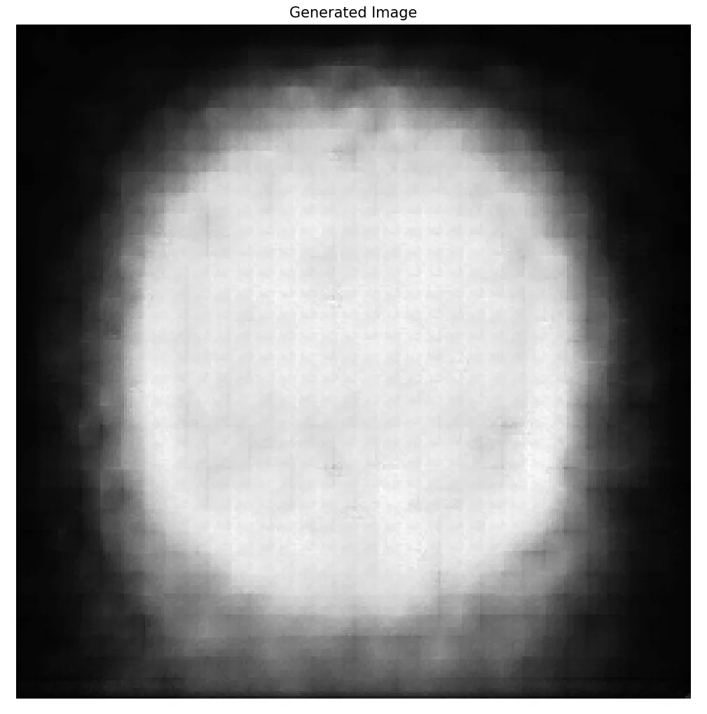

# project introduction
    this project is a continue learning project for me. I stored every tag for my experiment.

###  aim
    1. I want to realize the VAE model and generate some medical images.
    2. I want to realize the Diffusion model and contact with the VAE model.
    3. compare my model with the original model or orther model as a baseline.

### version details list
    In this part , I will record the every experiment version.
#### v1.0.0 2025/06/28 
    I realized the VAE model. But the result may really bad.you can see the result of 50 epochs.
|  |  |
| :------------------------------------: | :------------------------------------: |

#### v1.0.2 2025/06/30
    使用jupyter 运行一个人家写好的ddpm代码，用的是hugface的diffuers代码
    完成了基础模块，现在需要把人家的模型训练自己的训练集